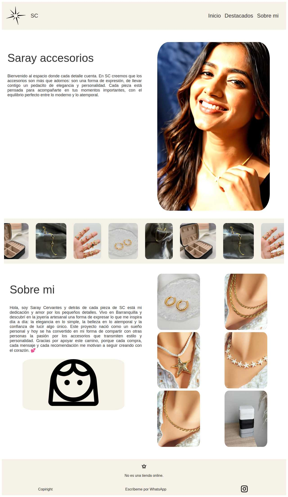

# 💎 Saray Accesorios - Landing Page

> Landing Page elegante y moderna para presentar el emprendimiento de joyería artesanal "Saray Accesorios (SC)"



## 📋 Descripción General

**Saray Accesorios (SC)** es una landing page diseñada para mostrar y promocionar el emprendimiento de joyería artesanal de Saray Cervantes, ubicada en Barranquilla. El sitio web presenta una experiencia visual atractiva que refleja la elegancia y calidad de los accesorios hechos a mano.

### ✨ Características Principales

- **Diseño responsivo** adaptado a dispositivos móviles y desktop
- **Carrusel de imágenes** para mostrar productos destacados
- **Video promocional** integrado en la sección principal
- **Sección "Sobre mí"** con la historia personal de la emprendedora
- **Integración con WhatsApp** para contacto directo con clientes
- **Navegación suave** entre secciones
- **Paleta de colores elegante** que refleja la marca

## 🛠️ Tecnologías Utilizadas

- **HTML5** - Estructura semántica del sitio web
- **CSS3** - Estilos, animaciones y diseño responsivo
- **JavaScript** - Funcionalidad del carrusel e interactividad
- **Google Fonts** - Tipografía Balsamiq Sans
- **SVG Icons** - Iconografía vectorial para mejor calidad
- **Video HTML5** - Contenido multimedia optimizado

## 🚀 Cómo Ejecutar el Proyecto

### Requisitos Previos
- Navegador web moderno (Chrome, Firefox, Safari, Edge)
- Servidor web local (opcional para desarrollo)

### Instalación y Ejecución

1. **Clonar el repositorio:**
   ```bash
   git clone https://github.com/JUNIORRDSR/pagina-web-sc.git
   cd pagina-web-sc
   ```

2. **Opción 1: Abrir directamente**
   - Hacer doble clic en `index.html`
   - O arrastrar el archivo a tu navegador

3. **Opción 2: Usar servidor local (recomendado para desarrollo)**
   ```bash
   # Con Python 3
   python -m http.server 8080
   
   # Con Node.js (si tienes http-server instalado)
   npx http-server -p 8080
   
   # Con PHP
   php -S localhost:8080
   ```
   
   Luego visitar: `http://localhost:8080`

## 📁 Estructura del Proyecto

```
pagina-web-sc/
├── index.html              # Página principal
├── CSS/
│   └── style.css          # Estilos principales
├── JS/
│   └── app.js             # JavaScript para funcionalidad
├── img/                   # Recursos visuales
│   ├── icons/             # Iconos y logos
│   ├── anillos/           # Imágenes de anillos
│   ├── argollas/          # Imágenes de argollas
│   ├── cadenas/           # Imágenes de cadenas
│   ├── joyero/            # Imágenes de joyeros
│   ├── pulseras/          # Imágenes de pulseras
│   └── video/             # Videos promocionales
├── README.md              # Documentación del proyecto
└── preview.png            # Imagen preview del sitio
```

## 🎨 Secciones del Sitio Web

### 🏠 Inicio
- Presentación principal de la marca
- Video promocional de productos
- Mensaje de bienvenida y filosofía de la marca

### ⭐ Destacados
- Carrusel automático con productos destacados
- Animación continua para mostrar la variedad de productos
- Imágenes de alta calidad de joyería artesanal

### 👩‍💼 Sobre Mí
- Historia personal de Saray Cervantes
- Filosofía y valores del emprendimiento
- Conexión emocional con los clientes

## 📱 Contacto y Redes Sociales

- **WhatsApp:** [+57 320 632 7979](https://wa.me/573206327979?text=Hola%20quiero%20información)
- **Instagram:** Disponible en el footer del sitio
- **Ubicación:** Barranquilla, Colombia

## 🚀 Despliegue

### GitHub Pages
1. Ir a Settings del repositorio
2. Navegar a Pages
3. Seleccionar source: Deploy from a branch
4. Elegir branch: main
5. El sitio estará disponible en: `https://JUNIORRDSR.github.io/pagina-web-sc`

### Netlify
1. Conectar repositorio de GitHub
2. Configurar build settings:
   - Build command: (dejar vacío)
   - Publish directory: `/`
3. Hacer deploy automático

### Vercel
1. Importar proyecto desde GitHub
2. Configurar como sitio estático
3. Deploy automático

## 🎯 Funcionalidades Destacadas

- **Navegación suave:** Enlaces internos con scroll suave entre secciones
- **Carrusel infinito:** Rotación automática de imágenes de productos
- **Diseño responsivo:** Optimizado para móviles con menú hamburguesa
- **Carga optimizada:** Imágenes y videos optimizados para web
- **SEO básico:** Meta tags y estructura semántica

## 📝 Notas Importantes

- **No es una tienda online:** El sitio es informativo y de contacto
- **Contacto directo:** Los pedidos se manejan vía WhatsApp
- **Contenido visual:** Todas las imágenes son de productos reales
- **Actualizaciones:** El carrusel puede actualizarse agregando nuevas imágenes

## 🤝 Créditos y Enlaces

### Desarrollador
- **Desarrollado por:** JUNIORRDSR
- **GitHub:** [@JUNIORRDSR](https://github.com/JUNIORRDSR)

### Recursos Utilizados
- **Fuentes:** [Google Fonts - Balsamiq Sans](https://fonts.google.com/specimen/Balsamiq+Sans)
- **Iconos:** Iconos personalizados en formato SVG
- **Inspiración:** Diseño minimalista y elegante para joyería artesanal

### Cliente
- **Saray Cervantes** - Emprendedora y artesana
- **Saray Accesorios (SC)** - Barranquilla, Colombia

---

## 📄 Licencia

Este proyecto es de uso privado para Saray Accesorios. Todos los derechos reservados.

---

*Hecho con ❤️ para Saray Accesorios*
